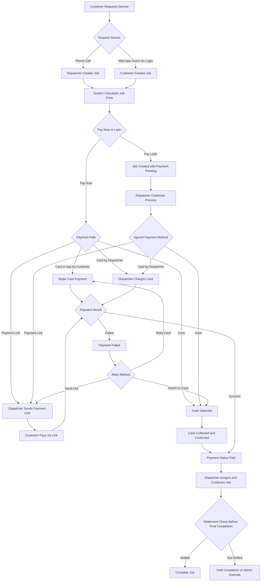

```mermaid
flowchart TD
    A[Customer Requests Service] --> B{Request Source}
    B -->|Phone Call| C[Dispatcher Creates Job]
    B -->|Web App Guest No Login| D[Customer Creates Job]
    C --> E[System Calculates Job Price]
    D --> E
    E --> F{Pay Now or Later}

    F -->|Pay Now| G{Payment Path}
    G -->|Card in App by Customer| H[Stripe Card Payment]
    G -->|Card by Dispatcher| I[Dispatcher Charges Card]
    G -->|Payment Link| J[Dispatcher Sends Payment Link]
    G -->|Cash| K[Cash Selected]

    H --> L{Payment Result}
    I --> L
    J --> M[Customer Pays via Link]
    M --> L
    K --> N[Cash Collected and Confirmed]
    N --> O[Payment Status Paid]

    F -->|Pay Later| P[Job Created with Payment Pending]
    P --> Q[Dispatcher Continues Process]
    Q --> R{Agreed Payment Method}
    R -->|Payment Link| J
    R -->|Card by Dispatcher| I
    R -->|Cash| K

    L -->|Success| O
    L -->|Failed| S[Payment Failed]
    S --> T{Retry Method}
    T -->|Retry Card| H
    T -->|Send Link| J
    T -->|Switch to Cash| K

    O --> U[Dispatcher Assigns and Continues Job]
    U --> V{Settlement Check Before Final Completion}
    V -->|Settled| W[Complete Job]
    V -->|Not Settled| X[Hold Completion or Admin Override]
```
